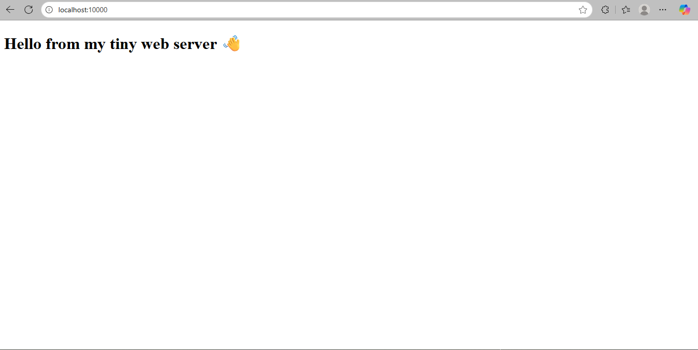
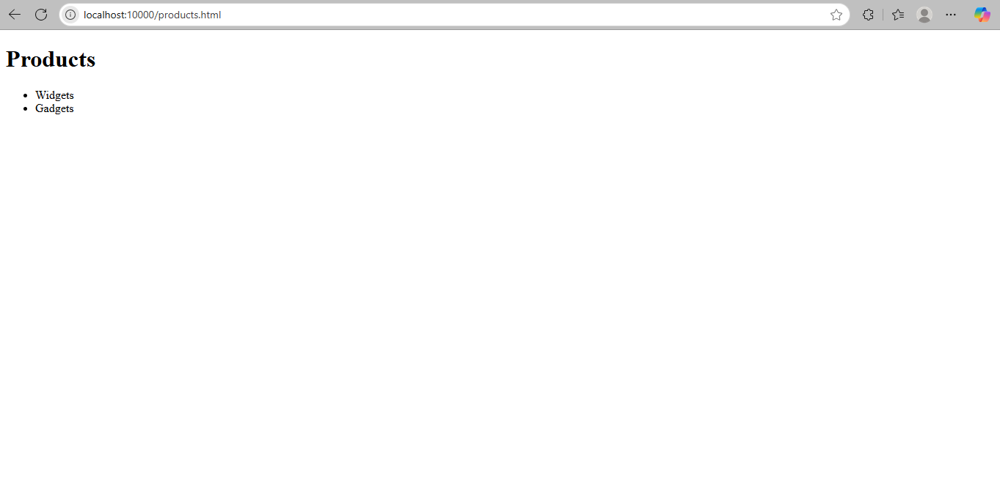
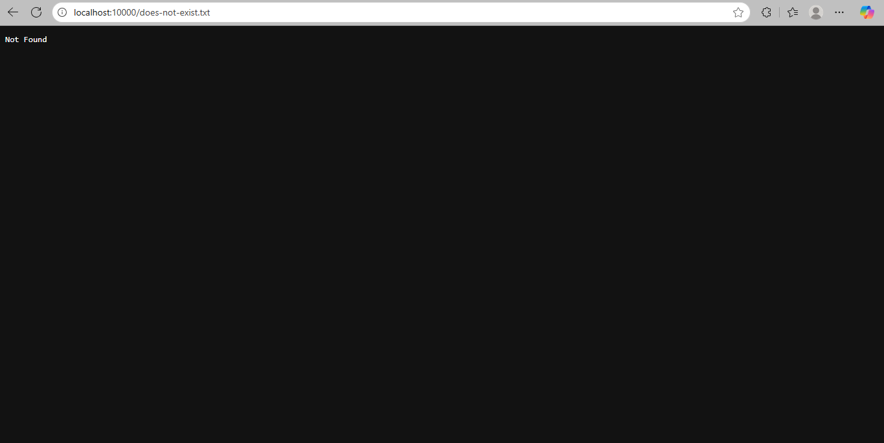

# Tiny Web Server — wserver 🌐⚡  
Multithreaded Static File Server with Thread Pool, Bounded Queue, and Safe Paths


---

## ✨ Overview
A compact HTTP/1.0 static file server in C with:
- **Thread pool** + **bounded request queue**
- **Safe path resolution** (no `..` traversal)
- **MIME detection** for common types
- **Zero-copy** fast path using `sendfile()` when available

---

## 🔍 Features
- HTTP/1.0 responses: `200`, `404`, `405` with headers  
- Flags:
  - `-d` → docroot (default: `./public`)
  - `-p` → port (default: `10000`)
  - `-t` → number of worker threads (default: `8`)
  - `-b` → queue size (default: `128`)
- Thread pool (pthreads) with producer/consumer queue  
- `realpath()` safe path normalization  
- Basic MIME map: `.html`, `.css`, `.js`, `.png`, `.jpg`, `.gif`, `.svg`, `.txt`, …

---

## 🚦 Quickstart

Build:
```bash
make
```

Run:
```bash
./wserver -d ./public -p 10000 -t 8 -b 128
```

Open in a browser:
```arduino
http://localhost:10000/
```

Or curl:
```bash
curl -i http://localhost:10000/
curl -i http://localhost:10000/does-not-exist.txt   # expect 404
```

## 📁 Repository Layout
```bash
code-tinyweb-server/
├─ src/         # server source (wserver.c, helpers)
├─ public/      # static files to serve (index.html, assets/)
├─ docs/        # screenshots, benchmarks
├─ tests/       # optional scripts
├─ Makefile     # gcc + pthread + sendfile
└─ README.md
```

📊 Benchmarks (ApacheBench)

Add this block to your README:

## 📊 Benchmarks (ApacheBench)

All runs on localhost against `/index.html` with `-t 8` threads and queue `-b 128` (your machine may differ).

| Run | Requests | Concurrency | RPS (mean) | P50 (ms) | Max (ms) | Failures |
|-----|---------:|------------:|-----------:|---------:|---------:|---------:|
| #1  | 1000     | 50          | **1235.6** | **42**   | 48       | 0        |
| #2  | 500      | 50          | **1146.2** | **43**   | 47       | 0        |

Run #1
- Requests per second: 1235.57 [#/sec] (mean)
- Time per request: 40.467 [ms] (mean)
- P50: 42 ms, max: 48 ms, failures: 0

Run #2
- Requests per second: 1146.15 [#/sec] (mean)
- Time per request: 43.624 [ms] (mean)
- P50: 43 ms, max: 47 ms, failures: 0


Reproduce locally:
```bash
> # install ApacheBench on Ubuntu/Debian
> sudo apt-get install -y apache2-utils
>
> # start server (example)
> ./wserver -d ./public -p 10000 -t 8 -b 128 &
> 
> # warm-up (optional)
> ab -n 200 -c 50 http://127.0.0.1:10000/index.html
>
> # runs
> ab -n 1000 -c 50 http://127.0.0.1:10000/index.html
> ab -n 500  -c 50 http://127.0.0.1:10000/index.html
>
```

## 🖼️ Demo images

Since you have demo (1, 2, 3).png, put them in docs/ and link them like this:

## 🖼️ Demo

<p align="center">
  
  
</p>

<p align="center">
  
</p>


Or, if you prefer simple Markdown:


## 🔮 Roadmap
- keep-alive support (HTTP/1.1)
- Directory listings toggle
- Access logs + latency histograms
- Basic cache headers

## 📜 License
MIT (see LICENSE)

---
